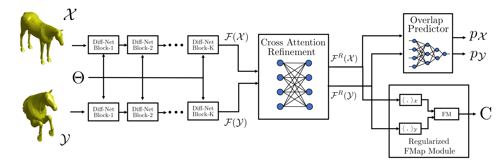

# DPFM
[](https://arxiv.org/abs/2110.09994) [](https://github.com/pvnieo/cp2p-pfarm-benchmark)


Code for "DPFM: Deep Partial Functional Maps" - 3DV 2021 (Oral)



## Installation
This implementation runs on python >= 3.7, use pip to install dependencies:
```bash
pip3 install -r requirements.txt
```

## Download data & preprocessing
The data should be downloaded and placed in the `data` folder. Each data folder should have two subfolders: `shapes` which contains the 3D meshes, and `maps` which contains the point-to-point ground truth maps that are used for training.

```
├── dpfm
│   ├── data
│   │   ├── my_dataset
│   │   |   ├── shapes
│   │   │   │   ├── shape1.off
│   │   |   │   ├── shape2.off
│   │   │   │   ├── ...
│   │   │   ├── maps
│   │   │   │   ├── gt_p2p1.map
│   │   │   │   ├── gt_p2p2.map
│   │   │   │   ├── ...
│   ├── diffusion_net
│   │   ├── ...
│   ├── eval_shrec_partial.py
│   ├── model.py
│   ├── ...
```

The data will be automatically processed when the training script is executed.

The datasets used in our paper are provided the [dataset repository](https://github.com/pvnieo/cp2p-pfarm-benchmark).

## Usage
To train DPFM model on the shrec 16 partial dataset, use the training script:
```bash
python3 train_shrec_partial.py --config shrec16_cuts
# OR
python3 train_shrec_partial.py --config shrec16_holes
```

To evaluate a trained model, use:
```bash
python3 eval_shrec_partial.py --config shrec16_cuts --model_path path/to/saved/model --predictions_name path/to/save/perdiction/file
```

We provide two pre-trained models on the shrec 16 partial dataset which are available in `data/saved_models`.

## Citation
```bibtex
@inproceedings{attaiki2021dpfm,
  doi = {10.1109/3dv53792.2021.00040},
  url = {https://doi.org/10.1109/3dv53792.2021.00040},
  year = {2021},
  month = dec,
  publisher = {{IEEE}},
  author = {Souhaib Attaiki and Gautam Pai and Maks Ovsjanikov},
  title = {{DPFM}: Deep Partial Functional Maps},
  booktitle = {2021 International Conference on 3D Vision (3DV)}
}
```